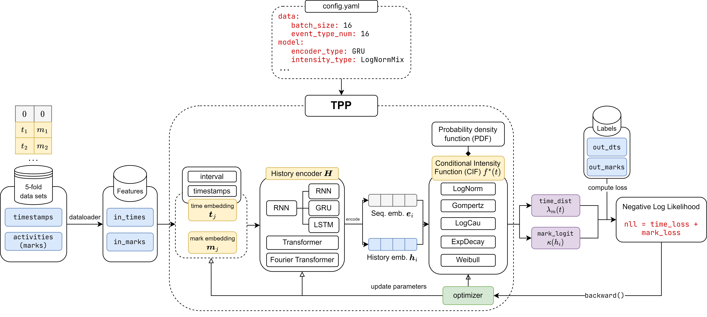

# Review: Temporal Point Process on Predictive Business Process Monitoring



The repository is forked and based on Extensive Deep Temporal Point Processes Framework [1] and Deep Learning in Predictive Business Process Monitoring Review [2]. We thank the authors for their great work.

## Installation

Requiring packages:

```bash
pip install -r requirements.txt
```

### Dataset

#### Converting from raw data to .pkl dataset

We evaluate on two real-world datasets: ``helpdesk`` and ``bpi_challenge_2012``. These datasets are generated and split
by Rama et al. [1] for Tax et al. method and put them into a folder in located in ``./data/`` as
follows: ``./data/{dataset_name}/``
The script for converting is also available in ``./scripts/``. For example:

```bash
python ./scripts/tax_dataloader.py --dataset BPI_Challenge_2012
```

Other datasets generated from Rama-Maneiro et al. [1] for Tax et al. method such as BPI 2012 A, BPI 2012 Complete, BPI
2012 O, BPI 2012 W, BPI 2012 W Complete, BPI 2013 Closed Problems, BPI 2013 Incidents, Env Permit, Sepsis can also be
processed via this script.

#### Preprocessing the .pkl dataset

We preprocess the raw data to make it suitable for training TPP models. The preprocessing code is also available
in ``./scripts/``. For example:

```bash
python ./scripts/generate_helpdesk_data.py
```

### Configuration

A configuration file must be defined for each dataset is defined in ``./experiment/{dataset_name}/config.yaml``
The ``.yaml`` files consist following kwargs:

```
log_level: INFO

fold: The index of the fold data to use for training/val/test

data:
  batch_size: The batch size for training
  dataset_dir: The processed dataset directory
  val_batch_size: The batch size for validation and test
  event_type_num: Number of the event types in the dataset. {'Helpdesk': 16, BPI_Challenge_2012': 37}

model:
  encoder_type: Used history encoder, chosen in [FNet, RNN, LSTM, GRU, Attention]
  intensity_type: Used intensity function, chosen in [LogNormMix, GomptMix, LogCauMix, ExpDecayMix, WeibMix, GaussianMix] and 
        [LogNormMixSingle, GomptMixSingle, LogCauMixSingle, ExpDecayMixSingle, WeibMixSingle, GaussianMixSingle, FNNIntegralSingle],
        where *Single means modeling the overall intensities
  time_embed_type: Time embedding, chosen in [Linear, Trigono]
  embed_dim: Embeded dimension
  lag_step: Predefined lag step, which is only used when intra_encoding is true
  atten_heads: Attention heads, only used in Attention encoder, must be a divisor of embed_dim.
  layer_num: The layers number in the encoder and history encoder
  dropout: Dropout ratio, must be in 0.0-1.0
  gumbel_tau: Initial temperature in Gumbel-max
  l1_lambda: Weight to control the sparsity of Granger causality graph
  use_prior_graph: Only be true when the ganger graph is given, chosen in [true, false]
  intra_encoding: Whether to use intra-type encoding,  chosen in [true, false]

train:
  epochs: Training epoches
  lr: Initial learning rate
  log_dir: Diretory for logger
  lr_decay_ratio: The decay ratio of learning rate
  max_grad_norm: Max gradient norm
  min_learning_rate: Min learning rate
  optimizer: The optimizer to use, chosen in [adam]
  patience: Epoch for early stopping 
  steps: Epoch numbers for learning rate decay. 
  test_every_n_epochs: 10
  experiment_name: and str, such as 'stackoverflow'
  delayed_grad_epoch: 10
  relation_inference: Whether to use graph discovery, chosen in [true, false],
        if false, but intra_encoding is true, the graph will be complete.
  
gpu: The GPU number to use for training

seed: Random Seed
```

### Training

You can train the model with the following commands in parallel:

```bash
python main.py --dataset helpdesk
```

```bash
python main.py --dataset BPI_Challenge_2012
```

*Note: Whenever you want to train a new model, please delete the old checkpoint directory
at ``./experiment/{dataset_name}/{dataset_name}_debug``.*

## References

[1] H. Lin, C. Tan, L. Wu, Z. Gao, and S. Z. Li, “An Empirical Study: Extensive Deep Temporal Point Process,” arXiv.org, 2021. https://arxiv.org/abs/2110.09823

[2] E. Rama-Maneiro, J. Vidal, and M. Lama, “Deep Learning for Predictive Business Process Monitoring: Review and  Benchmark,” IEEE Transactions on Services Computing, pp. 1–1, 2022, doi: https://doi.org/10.1109/tsc.2021.3139807.